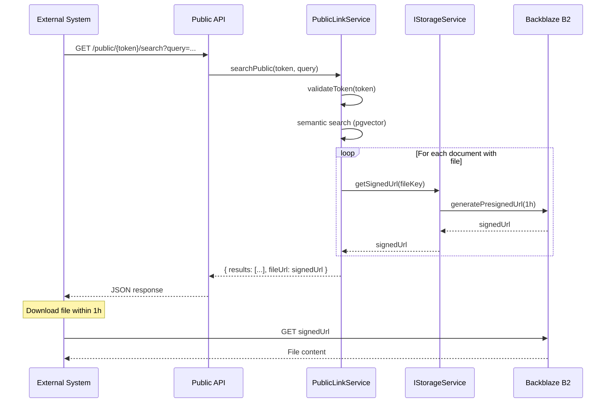

# Documentation Review Report - 2025-12-25 15:00

## Documentation Review Results

### Kontekst

- Specyfikacja: SPEC-016-frontend-public-links.md
- Produkty dotknięte: apps/api (public-link service)
- ADR sprawdzone: brak katalogu docs/adr/
- Zmiany w konwersacji: Implementacja signed URLs dla plików PDF w publicznym API

### Zmienione pliki

- apps/api/src/application/public-link/public-link.module.ts (dodano StorageModule)
- apps/api/src/application/public-link/public-link.service.ts (dodano getSignedFileUrl)

### Specyfikacja

Status: SPEC-016-frontend-public-links.md - Draft

Odchylenia od specyfikacji:
- Specyfikacja nie wspomina o signed URLs dla plików
- Implementacja dodaje funkcjonalność bezpieczeństwa wykraczającą poza specyfikację
- To pozytywne odchylenie (security enhancement)

---

## 🔴 CRITICAL (dokumentacja wprowadza w błąd)

### [SPEC-016] Brak informacji o fileUrl w response

**Problem:** Specyfikacja SPEC-016 nie definiuje struktury odpowiedzi API zawierającej fileUrl.

**Aktualny stan kodu:**
- PublicDocumentDto i PublicSearchResultDto zawierają pole `fileUrl: string | null`
- Wartość fileUrl to signed URL (ważny 1h)
- Pole to jest zwracane w API ale nie udokumentowane w SPEC-016

**Jak naprawić:**
Dodać do SPEC-016 sekcję 3.7:

```markdown
### 3.7 API Response Structure

#### Public Document Response

```typescript
interface PublicDocumentDto {
  id: string;
  title: string;
  content: string;
  tags: string[];
  verificationStatus: VerificationStatus;
  fileUrl: string | null;  // Signed URL (expires in 1h)
  createdAt: Date;
}
```

#### Public Search Result Response

```typescript
interface PublicSearchResultDto {
  documentId: string;
  chunkId: string;
  title: string;
  content: string;
  score: number;
  tags: string[];
  fileUrl: string | null;  // Signed URL (expires in 1h)
}
```

**Note:** fileUrl contains a pre-signed URL valid for 1 hour. External systems should download the file within this timeframe.
```

---

## 🟠 HIGH (brakująca kluczowa dokumentacja)

### [ADR] Brak Architecture Decision Record dla signed URLs vs public ACL

**Problem:** Implementacja używa signed URLs zamiast publicznych ACL na buckecie B2.

**Decyzja architektoniczna nie została udokumentowana:**
- Dlaczego signed URLs?
- Jakie są konsekwencje (expiration, performance)?
- Czy rozważano alternatywy (public ACL, CloudFront)?

**Jak naprawić:**
Utworzyć katalog `docs/adr/` i plik: `docs/adr/ADR-2025-12-25-signed-urls-for-public-files.md`

```markdown
# ADR-2025-12-25: Signed URLs for Public File Access

## Status

Accepted

## Kontekst

Public Links API musi umożliwiać dostęp do plików PDF (oryginalnych dokumentów) przez zewnętrzne systemy bez uwierzytelniania.

Rozważane opcje:
1. **Public ACL na buckecie B2** - pliki dostępne publicznie bez ograniczeń czasowych
2. **Signed URLs** - tymczasowe URL'e z wbudowaną autoryzacją (AWS S3 pre-signed URLs)
3. **Proxy endpoint** - API serwuje pliki przez własny endpoint

## Decyzja

Używamy **Signed URLs** generowanych przez AWS SDK (@aws-sdk/s3-request-presigner).

### Implementacja:
- Backend generuje signed URL przy każdym żądaniu API
- Domyślny czas wygaśnięcia: 3600s (1h)
- Wykorzystujemy istniejący interface IStorageService.getSignedUrl()

## Konsekwencje

### Pozytywne:
- **Security:** Nie wystawiamy plików publicznie na zawsze
- **Access Control:** Każdy dostęp do pliku wymaga ważnego public link token
- **Revocation:** Usunięcie public link natychmiast uniemożliwia generowanie nowych signed URLs
- **Audit:** Możliwość logowania dostępu do plików w przyszłości

### Negatywne:
- **Performance:** Dodatkowe opóźnienie na generowanie signed URL (~10-50ms per file)
- **Expiration:** Zewnętrzny system musi pobrać plik w ciągu 1h
- **Caching:** Trudniejsze cache'owanie odpowiedzi API (URL się zmienia)

### Trade-offs:
- Wybieramy security kosztem niewielkiego performance overhead
- 1h expiration to kompromis między bezpieczeństwem a user experience

## Alternatywy rozważone:

### Public ACL (odrzucone):
- Pliki dostępne publicznie bez kontroli
- Nie można cofnąć dostępu po usunięciu public link
- Brak audit trail

### Proxy endpoint (odrzucone):
- Backend musi streamować pliki (duże obciążenie)
- Brak wykorzystania CDN Backblaze
- Pełna kontrola nad dostępem (pozytyw)
```

Dodać do docs/README.md w sekcji "Decyzje architektoniczne":

```markdown
| Plik | Opis |
|------|------|
| [ARCHITECTURE_DECISION.md](ARCHITECTURE_DECISION.md) | Decyzja: standalone vs monolit |
| [adr/ADR-2025-12-25-signed-urls-for-public-files.md](adr/ADR-2025-12-25-signed-urls-for-public-files.md) | Signed URLs dla plików w Public API |
```

---

### [Swagger/OpenAPI] Brak opisu fileUrl w dokumentacji API

**Problem:** Swagger nie dokumentuje że fileUrl to signed URL z expirationem.

**Aktualny stan:**
```typescript
@ApiPropertyOptional()
fileUrl!: string | null;
```

**Jak naprawić:**
Zaktualizować apps/api/src/interfaces/dto/public.dto.ts:

```typescript
@ApiPropertyOptional({
  description: 'Pre-signed URL to original file (valid for 1 hour). Null if document is text-only.',
  example: 'https://bucket.s3.amazonaws.com/file.pdf?X-Amz-Algorithm=...'
})
fileUrl!: string | null;
```

---

## 🟡 MEDIUM (niekompletna dokumentacja)

### [SPEC-016] Brak informacji o limitach i performance

**Problem:** Specyfikacja nie wspomina o implikacjach performance signed URLs.

**Jak naprawić:**
Dodać do SPEC-016 sekcję 8 "Performance Considerations":

```markdown
## 8. Performance Considerations

### Signed URL Generation

Każde wywołanie public API generuje signed URLs dla wszystkich plików w odpowiedzi:
- **Koszt:** ~10-50ms per file
- **Impact:** Dla 20 dokumentów z plikami: ~200-1000ms dodatkowego opóźnienia

### Optymalizacje

1. **Limit results:** Użyj parametru `limit` aby ograniczyć ilość wyników
2. **Filter by tags:** Ogranicz zakres wyszukiwania do konkretnych tagów
3. **Cache aware:** Signed URLs się zmieniają - nie cache'uj odpowiedzi na długo

### Expiration

- Signed URLs ważne przez 1 godzinę
- Zewnętrzny system powinien pobrać plik od razu lub zapisać URL tymczasowo
- Po wygaśnięciu: ponowne wywołanie API generuje nowy URL
```

---

### [docs/README.md] Brak ADR w strukturze

**Problem:** docs/README.md wspomina o ADR ale katalog docs/adr/ nie istnieje.

**Jak naprawić:**
1. Utworzyć katalog `docs/adr/`
2. Zaktualizować docs/README.md:

```markdown
## Decyzje architektoniczne

| Plik | Opis |
|------|------|
| [ARCHITECTURE_DECISION.md](ARCHITECTURE_DECISION.md) | Decyzja: standalone vs monolit |
| [adr/](adr/) | Architecture Decision Records |
```

3. Dodać docs/adr/README.md:

```markdown
# Architecture Decision Records

## Proces ADR

ADR dokumentujemy dla:
- Wyboru technologii (biblioteka, framework, storage provider)
- Wzorców architektonicznych (DDD, Clean Architecture, Event Sourcing)
- Trade-offs (performance vs security, consistency vs availability)

## Format

```markdown
# ADR-YYYY-MM-DD: Tytuł

## Status
Accepted / Deprecated / Superseded by ADR-XXX

## Kontekst
Dlaczego potrzebowaliśmy podjąć decyzję?

## Decyzja
Co zdecydowaliśmy?

## Konsekwencje
### Pozytywne
### Negatywne
### Trade-offs
```

## Lista ADR

| Data | Tytuł | Status |
|------|-------|--------|
| 2025-12-25 | [Signed URLs for Public Files](ADR-2025-12-25-signed-urls-for-public-files.md) | Accepted |
```

---

### [Tests] Brak testów dla signed URLs

**Problem:** Funkcja getSignedFileUrl() nie ma testów jednostkowych.

**Jak naprawić:**
Utworzyć apps/api/src/application/public-link/public-link.service.spec.ts:

```typescript
describe('PublicLinkService', () => {
  describe('getSignedFileUrl', () => {
    it('should return null for null fileUrl', async () => {
      const result = await service['getSignedFileUrl'](null);
      expect(result).toBeNull();
    });

    it('should return null for fileUrl without key', async () => {
      const result = await service['getSignedFileUrl']('https://bucket.com/');
      expect(result).toBeNull();
    });

    it('should call storageService.getSignedUrl with correct key', async () => {
      const fileUrl = 'https://bucket.com/path/to/file.pdf';
      await service['getSignedFileUrl'](fileUrl);

      expect(mockStorageService.getSignedUrl).toHaveBeenCalledWith('file.pdf');
    });
  });

  describe('searchPublic - with files', () => {
    it('should return signed URLs for files', async () => {
      // Setup mock data with fileUrl
      const result = await service.searchPublic('valid-token', {
        query: 'test'
      });

      expect(result.results[0].fileUrl).toContain('X-Amz-Algorithm');
      expect(mockStorageService.getSignedUrl).toHaveBeenCalled();
    });
  });
});
```

---

## 🟢 LOW (sugestie ulepszenia)

### [SPEC-016] Przykłady API response mogą zawierać fileUrl

**Sugestia:** Dodać przykładową odpowiedź API w sekcji 3.6 UsageExample:

```typescript
// Dodać przykład JSON response
const exampleResponse = {
  workspace: "My Knowledge Base",
  results: [
    {
      documentId: "abc-123",
      chunkId: "chunk-456",
      title: "Product Manual",
      content: "How to configure...",
      score: 0.89,
      tags: ["support", "manual"],
      fileUrl: "https://bucket.s3.amazonaws.com/uuid-manual.pdf?X-Amz-Algorithm=AWS4-HMAC-SHA256&..."
    }
  ],
  totalCount: 15
};
```

---

### [CLAUDE.md] Nie wspomina o signed URLs w stack

**Sugestia:** Stack wspomina "File Storage: Backblaze B2" ale nie wyjaśnia mechanizmu dostępu.

Dodać do CLAUDE.md sekcji "Stack":

```markdown
- File Storage: Backblaze B2 (S3-compatible, signed URLs for public access)
```

---

### [Swagger] Dodać przykład URL expiration w description

**Sugestia:** Swagger UI mogłoby pokazywać dokładniejszy opis:

```typescript
@ApiPropertyOptional({
  description: `Pre-signed URL to original file.

  Security: URL is valid for 1 hour from generation time.
  The URL includes AWS signature that cannot be forged.

  Usage: Download the file immediately or within the expiration window.
  If expired, call the API again to get a fresh URL.`,
  example: 'https://bucket.s3.amazonaws.com/uuid-file.pdf?X-Amz-Algorithm=AWS4-HMAC-SHA256&X-Amz-Expires=3600&...',
  nullable: true
})
fileUrl!: string | null;
```

---

## ✅ Co jest dobrze udokumentowane

### Swagger/OpenAPI
- Public API endpoints mają @ApiOperation z opisami
- @ApiResponse definiuje kody błędów (404, 403)
- DTO są oznaczone @ApiProperty
- Throttling udokumentowany w kodzie (30 req/min)

### Kod
- Interface IStorageService.getSignedUrl() ma jasną sygnaturę
- Parametr expiresInSeconds ma domyślną wartość (3600)
- Implementacja BackblazeStorageService używa standardowego AWS SDK

### Specyfikacja
- SPEC-016 dobrze opisuje frontend (UI/UX, komponenty React)
- UsageExample pokazuje curl i Python
- Mockupy wizualne są przejrzyste

---

## 📝 Wymagane aktualizacje

| Dokument | Co zaktualizować | Priorytet |
|----------|------------------|-----------|
| SPEC-016-frontend-public-links.md | Dodać sekcję 3.7 "API Response Structure" z fileUrl | CRITICAL |
| SPEC-016-frontend-public-links.md | Dodać sekcję 8 "Performance Considerations" | MEDIUM |
| docs/adr/ | Utworzyć katalog i ADR dla signed URLs | HIGH |
| docs/README.md | Dodać link do docs/adr/ w sekcji ADR | MEDIUM |
| apps/api/src/interfaces/dto/public.dto.ts | Dodać description do fileUrl w @ApiPropertyOptional | HIGH |
| apps/api/src/application/public-link/public-link.service.spec.ts | Utworzyć testy dla getSignedFileUrl | MEDIUM |
| CLAUDE.md | Uzupełnić stack o "signed URLs for public access" | LOW |

---

## 💡 Sugestie ulepszeń dokumentacji

### Progressive Disclosure

| Dokument | Sugestia |
|----------|----------|
| SPEC-016 | Podzielić na backend i frontend spec (obecnie ~700 linii) |
| docs/README.md | Dodać quick links do najczęściej używanych dokumentów |

### Czytelność

| Sugestia | Uzasadnienie |
|----------|--------------|
| Dodać diagram sekwencji dla public link flow | Signed URL generation, validation, expiration - łatwiej zrozumieć wizualnie |
| Dodać mermaid diagram dla storage architecture | Pokazać relację API -> IStorageService -> Backblaze B2 -> Signed URL |

Przykład:



### Aktualność

- Swagger jest generowany z kodu - zawsze aktualny ✅
- DTO definicje w TypeScript - type safety ✅
- Specyfikacje mogą się dezaktualizować - wymaga ręcznej synchronizacji ⚠️

**Rekomendacja:** Dodać do PR template punkt: "Czy zaktualizowałeś specyfikację jeśli zmieniłeś API?"

---

## 📋 Podsumowanie

### Wynik review

- 🔴 CRITICAL: 1 problem (brak fileUrl w SPEC-016)
- 🟠 HIGH: 2 problemy (brak ADR, brak Swagger description)
- 🟡 MEDIUM: 3 problemy (performance docs, testy, docs/README)
- 🟢 LOW: 3 sugestie

### Rekomendacje

1. **Natychmiast:** Zaktualizować SPEC-016 o strukturę response z fileUrl
2. **Przed merge:** Utworzyć ADR dla signed URLs
3. **W następnym sprint:** Dodać testy jednostkowe dla getSignedFileUrl
4. **Nice to have:** Diagram sekwencji w dokumentacji

### Co działa dobrze

- Implementacja signed URLs jest bezpieczna i zgodna z best practices
- Swagger/OpenAPI są używane konsekwentnie
- Interface IStorageService dobrze oddziela infrastrukturę od logiki

### Główny wniosek

**Implementacja jest lepsza niż dokumentacja.** Kod dodaje security feature (signed URLs) którego specyfikacja nie przewidywała. To pozytywne, ale wymaga nadgonięcia dokumentacji.
