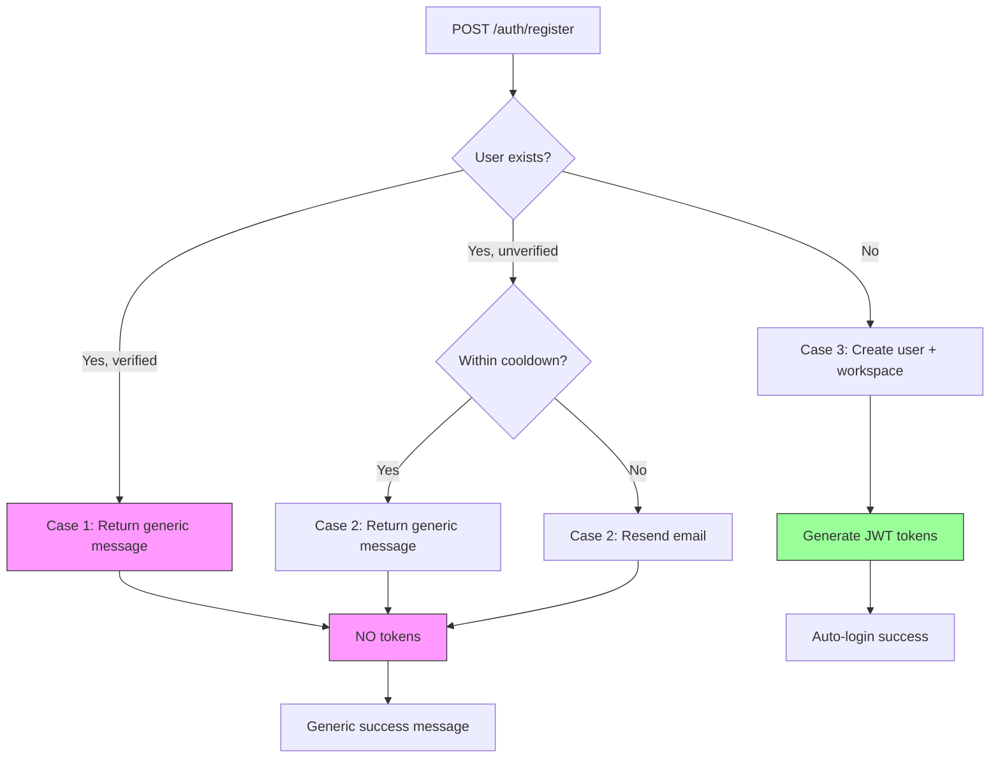

# Documentation Review Report - 2025-12-26

## Kontekst

**Reviewed Changes:**
- Commit: `b40ad61` - "feat: implement Cloud mode registration with grace period"
- Phase: 3/7 - Auth - Cloud Mode (from Implementation Plan)
- Files Changed: 3 files (auth.service.ts, auth.service.spec.ts, deployment.config.ts)
- Tests: 160 passing (+6 new from Phase 3)

**Products Affected:**
- Synjar Community (apps/api)
- Phase 3 specifically: Cloud Mode registration

**ADRs Reviewed:**
- enterprise/docs/adr/2025-12-26-deployment-mode-detection.md (implemented in Phase 1)
- community/docs/adr/ADR-2025-12-25-api-port-change-to-6200.md
- community/docs/adr/ADR-2025-12-25-signed-urls-for-public-files.md

**Specifications Reviewed:**
- enterprise/docs/specifications/2025-12-26-dual-mode-registration-IMPLEMENTATION-PLAN.md
- community/docs/specifications/2025-12-25-registration-with-email-verification.md

---

## Specyfikacja

**Specification:** 2025-12-26-dual-mode-registration-IMPLEMENTATION-PLAN.md (in enterprise repo)

**Status:** ✅ **Partial Implementation (Phase 3/7 Complete)**

**Phase 3 Deliverables (all met):**
- ✅ 6 new tests (3 register + 3 grace period)
- ✅ Registration with 3 cases implemented
- ✅ Grace period = 15 minutes (correct, not 60)
- ✅ User enumeration prevention (same message for all cases)
- ✅ DeploymentConfig integrated
- ✅ 160 tests passing total

**Deviations from Spec:** None identified for Phase 3

---

## 🔴 CRITICAL (dokumentacja wprowadza w błąd)

**None identified** - No critical documentation errors found.

---

## 🟠 HIGH (brakująca kluczowa dokumentacja)

### 1. [ADR] Missing Deployment Mode Detection ADR in Community Repo

**Problem:** ADR-2025-12-26-deployment-mode-detection.md exists in enterprise repo but not linked/copied to community repo.

**Impact:**
- Developers working in community repo won't understand DeploymentConfig design decisions
- The implementation references the ADR in comments (`@see docs/adr/2025-12-26-deployment-mode-detection.md`) but file doesn't exist in community

**How to fix:**
```bash
# Decision: Should this ADR be in community or enterprise?
# Option A: Copy to community (if decision affects community code)
cp ../enterprise/docs/adr/2025-12-26-deployment-mode-detection.md docs/adr/

# Option B: Keep in enterprise but update reference in code
# Change: @see ../../enterprise/docs/adr/2025-12-26-deployment-mode-detection.md
```

**Recommendation:** Copy to community - the deployment.config.ts is in community codebase.

---

### 2. [ecosystem.md] Missing Deployment Modes Section

**Problem:** ecosystem.md doesn't describe deployment modes (Cloud vs Self-hosted), yet this is fundamental to the architecture.

**Evidence from Implementation Plan:**
```markdown
**Related Decisions**
- [ecosystem.md - Deployment Modes](../ecosystem.md#1-deployment-modes)  # ← This section doesn't exist!
```

**How to fix:**
Add new section to `community/docs/ecosystem.md` after "Overview":

```markdown
## Deployment Modes

Synjar supports two deployment modes with different registration flows:

| Mode | Detection | Registration | Email Verification | Use Case |
|------|-----------|--------------|-------------------|----------|
| **Cloud** | DEPLOYMENT_MODE=cloud OR STRIPE_SECRET_KEY exists | Public, auto-login | Required (15-min grace) | synjar.com SaaS |
| **Self-hosted** | Default (no indicators) | First user only, admin | Optional | Community instances |

**Auto-detection:**
1. Explicit `DEPLOYMENT_MODE` env var (recommended)
2. Presence of `STRIPE_SECRET_KEY` → cloud
3. Default → self-hosted

**See:**
- [ADR-2025-12-26: Deployment Mode Detection](adr/2025-12-26-deployment-mode-detection.md)
- [SPEC: Dual-Mode Registration](../../enterprise/docs/specifications/2025-12-26-dual-mode-registration-IMPLEMENTATION-PLAN.md)
```

---

### 3. [README.md] Missing Implementation Plan Specification in Index

**Problem:** The main specification index (`docs/README.md`) doesn't list the new dual-mode registration spec.

**Current state:**
```markdown
| [2025-12-24-synjar-mvp.md](specifications/2025-12-24-synjar-mvp.md) | MVP Specification | Completed |
| [2025-12-25-registration-with-email-verification.md](...) | Email verification | Draft |
```

**Missing:**
- 2025-12-26-dual-mode-registration-IMPLEMENTATION-PLAN.md (tracked in enterprise, but affects community)

**How to fix:**
Add to `community/docs/README.md`:

```markdown
| File | Description | Status |
|------|-------------|--------|
| [2025-12-25-registration-with-email-verification.md](specifications/2025-12-25-registration-with-email-verification.md) | Email verification (superseded) | Draft |
| [../../enterprise/docs/specifications/2025-12-26-dual-mode-registration-IMPLEMENTATION-PLAN.md](../../enterprise/docs/specifications/2025-12-26-dual-mode-registration-IMPLEMENTATION-PLAN.md) | Dual-mode registration (Cloud + Self-hosted) | 🔄 Phase 3/7 |
```

**Note:** Include cross-repo link or move spec to community if it's fully open-source.

---

## 🟡 MEDIUM (do uzupełnienia)

### 1. [Specification Tracker] Missing Progress Update

**Problem:** Implementation Plan has tracker template but user mentioned "spec tracker updated" which suggests a tracker exists somewhere, but I cannot find it updated with Phase 3 completion.

**Expected location:** Top of `2025-12-26-dual-mode-registration-IMPLEMENTATION-PLAN.md`

**How to fix:**
Add to top of Implementation Plan:

```markdown
## Implementation Progress Tracker

**Status:** 🔄 In Progress
**Started:** 2025-12-26
**Current Phase:** Phase 4/7 (next: Self-hosted Mode)

| Phase | Status | Completed | Files Changed |
|-------|--------|-----------|---------------|
| 1. Foundation (Utils) | ✅ Done | 2025-12-26 11:00 | deployment.config.ts, password.validator.ts |
| 2. Database Schema | ✅ Done | 2025-12-26 11:30 | schema.prisma, migration 20251226112831 |
| 3. Auth - Cloud Mode | ✅ Done | 2025-12-26 13:20 | auth.service.ts, auth.service.spec.ts |
| 4. Auth - Self-hosted | ⏳ Not Started | - | - |
| 5. Invitation System | ⏳ Not Started | - | - |
| 6. Security | ⏳ Not Started | - | - |
| 7. Testing & Docs | ⏳ Not Started | - | - |

**Legend:** ⏳ Not Started | 🔄 In Progress | ✅ Done | ❌ Blocked
```

---

### 2. [Comments] Minimal "Why" Documentation in Code

**Problem:** While code is clean, critical business logic lacks "why" comments.

**Examples needing "why" comments:**

**auth.service.ts:72-78** - Case 1: Existing verified user
```typescript
// Case 1: User exists and is verified → NO tokens (prevent account takeover)
if (existing && existing.isEmailVerified) {
  return {
    message: 'Registration successful. Please check your email.',
    userId: existing.id,
  };
}
```

**Missing "why":** Why return same message? Why no tokens?

**Suggested comment:**
```typescript
// Case 1: User exists and is verified → NO tokens
// WHY: Prevent account takeover via registration endpoint
// Security: Same message as new user (prevents email enumeration)
if (existing && existing.isEmailVerified) {
  return {
    message: 'Registration successful. Please check your email.', // Generic message
    userId: existing.id,
  };
}
```

**auth.service.ts:199-210** - Grace period check
```typescript
// Grace period check (15 minutes for unverified users)
if (!user.isEmailVerified) {
  const GRACE_PERIOD_MS = 15 * 60 * 1000; // 15 minutes
  const accountAge = Date.now() - user.createdAt.getTime();

  if (accountAge >= GRACE_PERIOD_MS) {
    throw new UnauthorizedException(
      'Please verify your email before logging in',
    );
  }
  // Within grace period - allow login
}
```

**Missing "why":** Why 15 minutes? What's the UX rationale?

**Suggested comment:**
```typescript
// Grace period check (15 minutes for unverified users)
// WHY: Allow immediate login after registration for better UX
// Security: Limited window prevents prolonged unverified access
// Trade-off: 15 min = enough for email delivery delays, short enough for security
if (!user.isEmailVerified) {
  const GRACE_PERIOD_MS = 15 * 60 * 1000; // 15 minutes
  const accountAge = Date.now() - user.createdAt.getTime();

  if (accountAge >= GRACE_PERIOD_MS) {
    throw new UnauthorizedException(
      'Please verify your email before logging in',
    );
  }
  // Within grace period - allow login
}
```

---

### 3. [Tests] Missing Test Documentation Header

**Problem:** auth.service.spec.ts has 160 tests but no header explaining test organization.

**How to fix:**
Add header to `auth.service.spec.ts`:

```typescript
/**
 * AuthService Test Suite
 *
 * Tests organized by feature:
 * - register() - Cloud Mode (3 cases)
 * - login() - Grace period (15 min)
 * - verifyEmail()
 * - resendVerification()
 *
 * Testing approach (CLAUDE.md):
 * - Stubs over mocks (behavior, not implementation)
 * - TDD: RED → GREEN → REFACTOR
 * - Integration tests with real adapters (separate file)
 *
 * @see docs/specifications/2025-12-26-dual-mode-registration-IMPLEMENTATION-PLAN.md
 * @see docs/adr/2025-12-26-deployment-mode-detection.md
 */
describe('AuthService', () => {
  // ...
});
```

---

### 4. [ecosystem.md] Missing Auth Context Update

**Problem:** ecosystem.md describes Auth Context but doesn't mention new features:
- Email verification fields
- Grace period logic
- Deployment mode detection

**Current Auth Context section (ecosystem.md:46-62):**
```markdown
### Auth Context

**Odpowiedzialność**: Autentykacja i autoryzacja użytkowników

**Entities**:
- `User` - użytkownik systemu (email, password hash)
- `Session` - JWT-based session management

**Use Cases**:
- Rejestracja użytkownika
- Login (JWT token generation)
- Token validation
```

**How to fix:**
Update to:

```markdown
### Auth Context

**Odpowiedzialność**: Autentykacja i autoryzacja użytkowników

**Entities**:
- `User` - użytkownik systemu (email, password hash, email verification)
- `Session` - JWT-based session management

**Use Cases**:
- **Registration (dual-mode)**:
  - Cloud: Public registration with email verification (15-min grace period)
  - Self-hosted: First user admin (no email required), subsequent users need invitation
- **Login**: JWT token generation with grace period check
- **Email Verification**: Token-based verification (24h TTL)
- **Token validation**: JWT-based access/refresh tokens

**Infrastructure**:
- `JwtStrategy` - Passport.js JWT authentication
- `BcryptService` - password hashing
- `DeploymentConfig` - Cloud vs Self-hosted mode detection
- `PasswordValidator` - 12+ chars, complexity rules

**Business Rules**:
- Grace period: 15 minutes for unverified users (Cloud mode)
- User enumeration prevention: Generic error messages
- Rate limiting: 3 req/min register, 5 req/min login
```

---

## 🟢 LOW (sugestia)

### 1. [Naming] Inconsistent Specification Naming

**Observation:** Two overlapping specifications:
- `2025-12-25-registration-with-email-verification.md` (community, Draft)
- `2025-12-26-dual-mode-registration-IMPLEMENTATION-PLAN.md` (enterprise, In Progress)

**Question:** Is the first spec superseded by the second?

**Suggestion:**
Add superseded notice to older spec:

```markdown
# SPEC-017: Registration with Email Verification

**Data:** 2025-12-25
**Status:** ⚠️ Superseded by [Dual-Mode Registration](../../enterprise/docs/specifications/2025-12-26-dual-mode-registration-IMPLEMENTATION-PLAN.md)
**Priorytet:** P0 (Foundation)
```

Or merge/consolidate if they serve different purposes.

---

### 2. [Testing] Missing E2E Test Plan Reference

**Observation:** Phase 3 complete with 160 unit tests, but E2E tests planned for Phase 7.

**Suggestion:**
Add comment in auth.service.ts linking to E2E test plan:

```typescript
/**
 * AuthService - Dual-Mode Registration
 *
 * @see docs/specifications/2025-12-26-dual-mode-registration-IMPLEMENTATION-PLAN.md
 * @see Phase 7 for E2E test scenarios (registration-e2e.integration.spec.ts)
 */
@Injectable()
export class AuthService {
```

---

### 3. [ADR] Missing Related Decisions Section

**Problem:** ADR-2025-12-26-deployment-mode-detection.md is comprehensive but doesn't link to related community ADRs.

**Suggestion:**
Add to ADR:

```markdown
## Related Community Decisions

- [ADR-2025-12-25-api-port-change-to-6200.md](../../community/docs/adr/ADR-2025-12-25-api-port-change-to-6200.md) - Port configuration
- [ADR-2025-12-25-signed-urls-for-public-files.md](../../community/docs/adr/ADR-2025-12-25-signed-urls-for-public-files.md) - Public access security
```

---

## ✅ Co jest dobrze udokumentowane

### Code Documentation
- ✅ **DeploymentConfig** - Excellent JSDoc with cache behavior, testing notes, links to specs/ADRs
- ✅ **Test coverage** - 160 tests passing, 6 new tests for Phase 3 deliverables
- ✅ **TDD approach** - Clear RED → GREEN → REFACTOR workflow in commit message

### ADR Quality
- ✅ **ADR-2025-12-26-deployment-mode-detection.md** - Comprehensive:
  - Clear problem statement
  - 4 options considered with pros/cons
  - Implementation examples
  - Consequences (positive + negative + risks)
  - Future considerations
  - Status tracking

### Specification Quality
- ✅ **Implementation Plan** - Well-structured:
  - 7 phases with clear deliverables
  - DoD for each phase
  - TDD approach mandated
  - Review checkpoints defined
  - Common pitfalls documented

### Test Quality
- ✅ **Behavior testing** - Tests verify outcomes, not implementation (CLAUDE.md compliant)
- ✅ **Descriptive names** - Test names clearly state what is being tested
- ✅ **Stubs over mocks** - Using stubs as per CLAUDE.md guidelines

---

## 📝 Wymagane aktualizacje

| Dokument | Co zaktualizować |
|----------|------------------|
| **ecosystem.md** | [HIGH] Add "Deployment Modes" section (table, auto-detection logic) |
| **ecosystem.md** | [MEDIUM] Update Auth Context (email verification, grace period, dual-mode) |
| **docs/README.md** | [HIGH] Add dual-mode spec to index with status "Phase 3/7" |
| **docs/adr/** | [HIGH] Copy ADR-2025-12-26-deployment-mode-detection.md from enterprise |
| **Implementation Plan** | [MEDIUM] Add Progress Tracker section showing Phase 1-3 ✅ Done |
| **auth.service.ts** | [MEDIUM] Add "why" comments for Case 1, grace period, security decisions |
| **auth.service.spec.ts** | [MEDIUM] Add test suite header (organization, TDD approach, links) |
| **2025-12-25-registration-with-email-verification.md** | [LOW] Add "Superseded by" notice if applicable |

---

## 💡 Sugestie ulepszeń dokumentacji

| Kategoria | Sugestia |
|-----------|----------|
| **Progressive Disclosure** | ✅ Already applied well - Implementation Plan links to main spec, ADRs separate from implementation |
| **Cross-linking** | Add bidirectional links: ecosystem.md ↔ ADRs ↔ specs ↔ code comments |
| **Version tracking** | Add "Last Updated" dates to ecosystem.md sections (currently only at bottom) |
| **Visual aids** | Add sequence diagram for registration flow (3 cases) to spec or ADR |
| **Onboarding** | Create ARCHITECTURE.md quickstart linking to: ecosystem.md → relevant ADRs → current specs |

### Specific Improvement: Registration Flow Diagram

**Location:** Add to Implementation Plan or ecosystem.md

```markdown
## Registration Flow (Cloud Mode)


```

**Rationale:** Visual representation helps developers understand the 3 cases at a glance.

---

## Summary Statistics

**Documentation Health:**
- 🔴 Critical: 0 issues
- 🟠 High: 3 issues (ADR missing, ecosystem.md gaps, spec index)
- 🟡 Medium: 4 issues (tracker, comments, test docs, ecosystem auth)
- 🟢 Low: 3 suggestions (naming, E2E ref, ADR links)

**Test Coverage:**
- ✅ 160 tests passing (100% success rate)
- ✅ 6 new tests for Phase 3 (3 register + 3 grace period)
- ✅ TDD approach followed (commit message confirms)

**Specification Alignment:**
- ✅ Phase 3 deliverables: 6/6 met
- ✅ No deviations from spec identified
- ⏳ Implementation Plan tracker needs update (Phase 3 → ✅ Done)

**Next Phase Readiness:**
- ✅ Phase 4 (Self-hosted Mode) can proceed
- ⚠️ Should update docs (HIGH priority items) before merge
- ✅ Foundation solid (DeploymentConfig, PasswordValidator)

---

## Recommendations

### Before Merge (HIGH Priority)
1. Copy ADR-2025-12-26-deployment-mode-detection.md to community/docs/adr/
2. Update ecosystem.md with Deployment Modes section
3. Update docs/README.md specification index
4. Update Implementation Plan progress tracker (Phase 3 ✅)

### Before Production (MEDIUM Priority)
5. Add "why" comments to critical security logic (auth.service.ts)
6. Update ecosystem.md Auth Context section
7. Add test suite header (auth.service.spec.ts)

### Nice to Have (LOW Priority)
8. Add registration flow diagram (Mermaid)
9. Consolidate/supersede old registration spec
10. Add cross-repo ADR links

---

**Review Completed By:** Documentation Reviewer Agent
**Review Date:** 2025-12-26 13:30
**Specification Status:** ✅ Partially Implemented (Phase 3/7 Complete)
**Overall Assessment:** 🟢 Good progress, documentation mostly accurate, needs updates for Phase 3 completion
