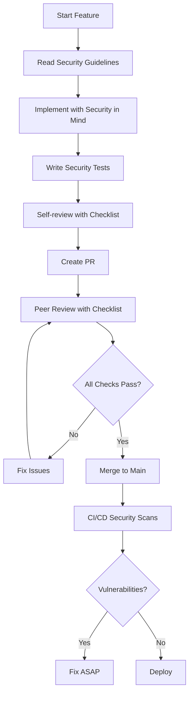
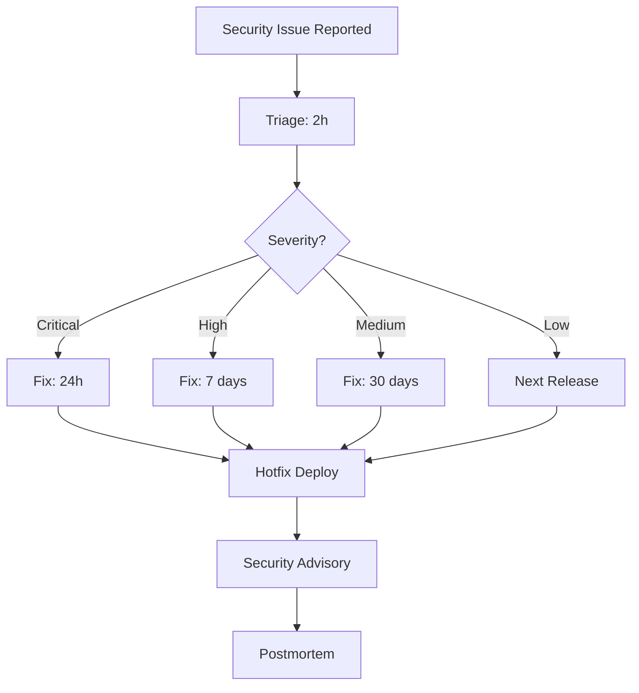

# Security Documentation - Synjar

**Status:** Active
**Owner:** Engineering Team
**Last updated:** 2025-12-25

---

## Overview

Ten folder zawiera kompleksową dokumentację bezpieczeństwa dla Synjar. Wszystkie dokumenty są mandatory reading dla developers.

**Core Principle:** Defense in Depth - wielowarstwowa ochrona multi-tenant architecture.

---

## Documents

### 1. Security Guidelines (MUST READ)

**File:** [SECURITY_GUIDELINES.md](./SECURITY_GUIDELINES.md)

**Purpose:** Zasady i best practices dla development.

**Key Topics:**
- Multi-tenant isolation (RLS)
- Authentication & Authorization
- Input validation
- SQL injection prevention
- Secrets management
- Rate limiting
- Security testing
- Logging & monitoring

**For:** Wszyscy developers

---

### 2. Implementation Plan

**File:** [IMPLEMENTATION_PLAN.md](./IMPLEMENTATION_PLAN.md)

**Purpose:** Konkretny roadmap wdrożenia mechanizmów security.

**Phases:**
- Phase 1: MVP Security (P0) - 2 tygodnie
- Phase 2: Post-MVP (P1) - 3 tygodnie
- Phase 3: Scale & Compliance (P2) - future

**For:** Tech leads, project managers

---

### 3. Code Review Security Checklist

**File:** [CODE_REVIEW_SECURITY_CHECKLIST.md](./CODE_REVIEW_SECURITY_CHECKLIST.md)

**Purpose:** Mandatory checklist dla code reviews.

**Sections:**
- Authentication & Authorization
- Multi-tenant isolation (RLS)
- Input validation
- SQL injection prevention
- Secrets management
- Error handling & logging
- Rate limiting
- Dependencies
- Tests
- OWASP Top 10 checks

**For:** Code reviewers (wszyscy developers)

---

## Research Reports

### Multi-Tenant Security in Open-Source

**File:** [../research/2025-12-25-multi-tenant-security-in-open-source.md](../research/2025-12-25-multi-tenant-security-in-open-source.md)

**Purpose:** Research na temat security w open-source multi-tenant apps.

**Key Topics:**
1. Ochrona kodu admin w open-source (plugin architecture, license validation)
2. Architektura multi-tenant (RLS, tenant isolation patterns)
3. Ochrona przed atakami (enumeration, data leakage, SQL injection)
4. Industry examples (GitLab, Supabase, Sentry, Metabase)
5. Minimalizacja ryzyka w open-source

**For:** Architects, tech leads, security team

---

## Quick Start

### For New Developers

1. **Przeczytaj:** [SECURITY_GUIDELINES.md](./SECURITY_GUIDELINES.md) (30 min)
2. **Zapoznaj się:** [CODE_REVIEW_SECURITY_CHECKLIST.md](./CODE_REVIEW_SECURITY_CHECKLIST.md) (15 min)
3. **Sprawdź:** Research report dla context (optional, 1h)

### For Code Reviewers

1. **Użyj:** [CODE_REVIEW_SECURITY_CHECKLIST.md](./CODE_REVIEW_SECURITY_CHECKLIST.md) dla każdego PR
2. **W razie wątpliwości:** Tag `@security-champion` w PR comments

### For Tech Leads

1. **Przeczytaj:** Wszystkie dokumenty (2h total)
2. **Sprawdź:** [IMPLEMENTATION_PLAN.md](./IMPLEMENTATION_PLAN.md) - tracking progress
3. **Review:** Monthly security metrics

---

## Security Workflow

### Development



### Incident Response



---

## Key Principles

### 1. Defense in Depth

Wielowarstwowa ochrona:

```
┌─────────────────────────────────────────────┐
│ Layer 1: Network (WAF, DDoS)               │
├─────────────────────────────────────────────┤
│ Layer 2: Application (Guards, Validation)  │
├─────────────────────────────────────────────┤
│ Layer 3: Database (RLS)                    │
├─────────────────────────────────────────────┤
│ Layer 4: Encryption (at rest, in transit)  │
└─────────────────────────────────────────────┘
```

### 2. Zero Trust

- Nigdy nie ufaj user input
- Waliduj wszystko (auth, authz, input)
- Assume breach (monitoring, logging)

### 3. Principle of Least Privilege

- User widzi tylko swoje workspace'y (RLS)
- Guards sprawdzają membership
- RBAC (OWNER vs MEMBER)

### 4. Secure by Default

- RLS enabled dla wszystkich tenant tables
- Guards required na protected endpoints
- Input validation via DTOs
- Rate limiting configured

---

## Security Testing

### Test Pyramid

```
         /\
        /E2E\         (10%) - Critical flows
       /------\
      /        \
     /Integration\    (30%) - Multi-tenant isolation
    /------------\
   /              \
  /  Unit Tests   \  (60%) - Guards, validators
 /------------------\
```

### Must-Have Tests

1. **Multi-tenant isolation**
   - User A cannot access User B resources
   - RLS prevents cross-tenant queries

2. **Authorization**
   - Guards reject unauthorized access
   - IDOR prevention

3. **Input validation**
   - DTOs reject invalid input
   - XSS/SQL injection payloads blocked

4. **Rate limiting**
   - DoS protection works
   - Per-endpoint limits enforced

---

## Security Metrics

### Weekly Tracking

| Metric | Target | Current | Trend |
|--------|--------|---------|-------|
| Security test coverage | > 90% | TBD | - |
| Critical vulnerabilities | 0 | TBD | - |
| RLS coverage | 100% | TBD | - |
| Auth/authz coverage | 100% | TBD | - |

### Monthly Review

- [ ] Dependency audit (pnpm audit, Snyk)
- [ ] Security test coverage report
- [ ] Incident response drill (simulation)
- [ ] Security awareness quiz (team)

---

## Incident Severity Levels

| Level | Description | Examples | SLA |
|-------|-------------|----------|-----|
| **Critical** | Data breach, RCE | Auth bypass, RLS failure | 24h |
| **High** | Privilege escalation | SQL injection, IDOR | 7 days |
| **Medium** | Limited impact | XSS, weak crypto | 30 days |
| **Low** | Minor issues | Info disclosure | Next release |

---

## Reporting Security Issues

### Internal (Team Members)

- **Slack:** `#security` channel
- **Email:** security@synjar.com
- **PagerDuty:** For critical issues (production)

### External (Researchers)

- **Email:** security@synjar.com
- **PGP Key:** Available on website
- **Disclosure Policy:** Coordinated (7 days private, then public)

**We appreciate responsible disclosure and will acknowledge contributors.**

---

## Security Champions

### Role Responsibilities

1. **Review PRs** z security perspective
2. **Mentoring** developers na security best practices
3. **Monthly audits** kodu i dependencies
4. **Incident response** coordination
5. **Security training** dla team

### Current Champions

- **Primary:** TBD (assign po launch MVP)
- **Backup:** TBD

---

## Compliance Roadmap

### MVP (Phase 1)

- [x] Security guidelines documented
- [ ] RLS implemented
- [ ] Guards enforced
- [ ] Input validation
- [ ] Security tests

### Post-MVP (Phase 2)

- [ ] Audit logging
- [ ] Encryption (at rest, in transit)
- [ ] License validation
- [ ] Advanced rate limiting

### Production (Phase 3)

- [ ] SOC2 Type 1
- [ ] Penetration testing (quarterly)
- [ ] Bug bounty program
- [ ] SOC2 Type 2

---

## Training Resources

### Required Reading

1. [OWASP Top 10](https://owasp.org/www-project-top-ten/)
2. [OWASP Multi-Tenancy Cheat Sheet](https://cheatsheetseries.owasp.org/cheatsheets/Multitenant_Security_Cheat_Sheet.html)
3. [PostgreSQL RLS Documentation](https://www.postgresql.org/docs/current/ddl-rowsecurity.html)

### Recommended Reading

1. [NestJS Security Best Practices](https://docs.nestjs.com/security/helmet)
2. [OWASP API Security Top 10](https://owasp.org/www-project-api-security/)
3. [Supabase RLS Guide](https://supabase.com/docs/guides/auth/row-level-security)

### Hands-on

- **OWASP WebGoat:** Vulnerable app dla learning
- **HackTheBox:** Security challenges
- **PentesterLab:** Web security exercises

---

## FAQ

### Q: Czy mogę użyć `$queryRawUnsafe`?

**A:** Tylko z parameteryzacją. Nigdy z user input bez escapowania.

```typescript
// ✅ OK
const result = await prisma.$queryRaw`
  SELECT * FROM "Document" WHERE id = ${documentId}
`;

// ❌ NEVER
const result = await prisma.$queryRawUnsafe(`
  SELECT * FROM "Document" WHERE id = '${documentId}'
`);
```

---

### Q: Czy muszę pisać testy security dla każdej funkcjonalności?

**A:** Tak, przynajmniej basic isolation test. Dla critical features (auth, payments) - comprehensive tests.

---

### Q: Co jeśli znalazłem lukę w production?

**A:** Natychmiast zgłoś na `#security` Slack lub security@synjar.com. Nie naprawiaj sam bez konsultacji.

---

### Q: Czy mogę zrobić bypass RLS dla performance?

**A:** Tylko w wyjątkowych przypadkach i po review z security champion. Zawsze dokumentuj uzasadnienie.

---

### Q: Jak często review dependencies?

**A:** Automated (Snyk): codziennie w CI/CD. Manual review: monthly. Critical vulns: fix immediately.

---

## Change Log

| Date | Author | Changes |
|------|--------|---------|
| 2025-12-25 | Claude | Initial security documentation |

---

## Next Steps

1. **Assign security champion** (1 week)
2. **Team training session** (security guidelines) - 2h workshop
3. **Start Phase 1 implementation** (per IMPLEMENTATION_PLAN.md)
4. **Setup CI/CD security scans** (GitHub Actions)
5. **Monthly review cadence** (track metrics)

---

**Questions?** Contact engineering team or open discussion in `#security`.
